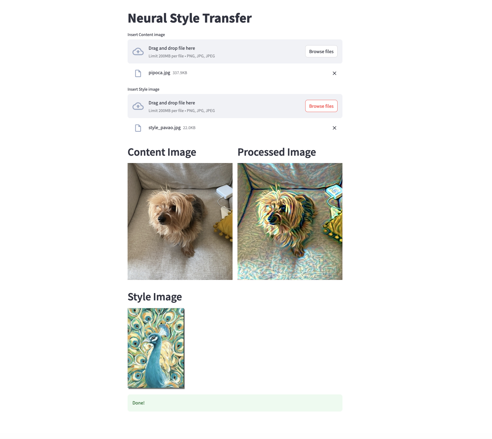

# Style Transfer with VGG16

[View and Use the app with this link](https://neuralstyletransfer-production.up.railway.app/)




This project implements Neural Style Transfer using the VGG16 architecture in TensorFlow and Keras. The goal is to blend the content of one image with the style of another by minimizing a combination of content loss, style loss, and total variation loss.

## Features

- Preprocessing and deprocessing images for the VGG16 model.
- Custom loss functions to capture content and style.
- Training loop to iteratively update the generated image using gradient descent.
- Configurable hyperparameters for content, style, and total variation loss.

## Installation

Clone this repository and install the required dependencies:

```bash
git clone https://github.com/brtenorio/NeuralStyleTransfer.git
cd NeuralStyleTransfer
make all
```


## Docker

To containerize the application, use:

    make docker-build

followed by

    make docker-run-app
